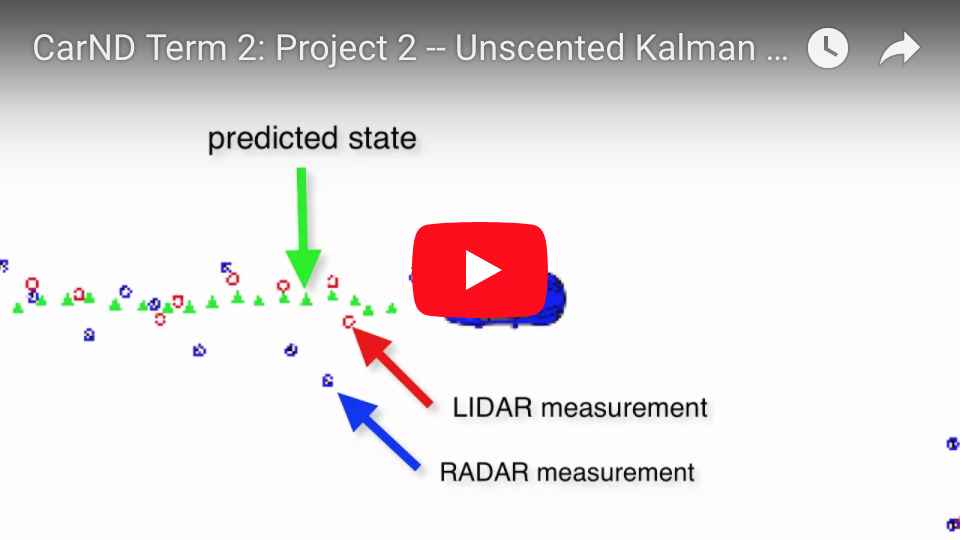
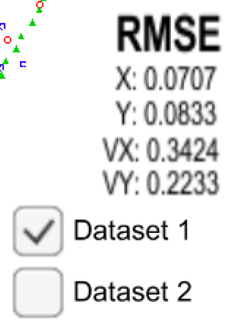
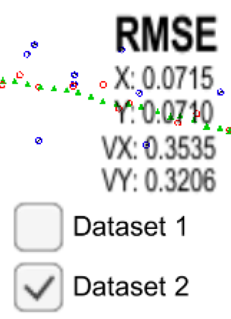

#### Udacity Self-Driving Car Engineer Nanodegree
#### Term 2
# Project 7: Unscented Kalman Filter

##### &nbsp;

## Goal & Background
As with the previous project working with [Extended Kalman Filters (EKF)](https://github.com/tommytracey/Udacity-CarND-Term2/tree/master/p1-extended-kalman-filter), the goal of this project is to build a tool that can accurately predict the location of a vehicle based on its lidar and radar sensor measurements. Given that different sensors will return different measurements, and that neither of these measurements may accurately reflect the true position of the car, we need to reconcile or "fuse" the various sensor inputs into one accurate prediction. To do this, we use Kalman Filters.

The __Unscented__ Kalman Filter (UKF) built in this project is a more sophisticated approach (mathematically) for combining sensor data. And, the UKF performs better than the EKF in many situations since it can leverage different motion models. There are various motion models we could use, such as Constant Velocity (CV), Constant Turn Rate and Velocity (CTRV), Constant Turn Rate and Acceleration (CTRA), and Constant Curvature and Acceleration (CCA).

For the EKF project, we used the Constant Velocity (CV) motion model, which assumes the vehicle will continue to move at the same velocity and that any change (i.e. acceleration or deceleration) is modeled by the “process noise.” However, for the UKF in this project we use Constant Turn Rate and Velocity (CTRV). While the CV model is only concerned with the position and velocity in the x and y dimensions, the CTRV model uses direction and magnitude to model the velocity (instead of x and y). CTRV also uses a “yaw rate” to model the change in direction from one moment to the next.

##### &nbsp;

### Initialize, Predict, Update
There are three main steps for programming a Kalman filter:

1. **Initialize** the Kalman filter variables.
1. **Predict** where our object is going to be after a time step Δt
1. **Update** where our object is based on sensor measurements. The 'predict' and 'update' steps then repeat themselves in a loop.

To measure how well our Kalman filter performs, we will then calculate the root mean squared error (RSME) comparing the Kalman filter results with the provided ground truth. For this project, the px, py, vx, vy output coordinates must have an RMSE <= [.09, .10, .40, .30].

These three steps (initialize, predict, update) plus calculating the RMSE encapsulate the entire Unscented Kalman Filter project.

##### &nbsp;

## Results

</a>

</a>

##### &nbsp;

## Implementation

### Files in the Github src Folder
The files we worked with are in the /src folder of the github repository.

- **main.cpp** &mdash; communicates with the Term 2 Simulator receiving data measurements, calls a function to run the Kalman filter, calls a function to calculate RMSE

- **ukf.cpp** &mdash; initializes the Kalman filter, calls the predict and update function, and defines the predict and update function

- **tools.cpp** &mdash; function to calculate RMSE

##### &nbsp;

### Scope & Steps
1. Fill in the code in `ukf.cpp`.

   You'll need to initialize the Kalman Filter and all required variables, prepare the Q and noise matrices for the prediction step, and call the radar and lidar update functions. You then need to write all of the functions including `ProcessMeasurement()`, `Predict()`, `UpdateLidar()`, and `UpdateRadar()`, plus any helper functions you want to use.

1. In `tools.cpp`, fill in the functions that calculate root mean squared error (RMSE).
1. Initialize the state vector.

   We need to initialize the state vector with the first sensor measurement.

   Although radar gives velocity data in the form of the range rate `ρ˙`, a radar measurement does not contain enough information to determine the state variable velocities `vx` and `vy`. We can, however, use the radar measurements `ρ` and `ϕ` to initialize the state variable locations `px` and `py`.

1. Normalize angles.

   In C++, `atan2()` returns values between -pi and pi. When calculating phi in `y = z - h(x)` for radar measurements, the resulting angle phi in the y vector should be adjusted so that it is between -pi and pi. The Kalman filter is expecting small angle values between the range -pi and pi. When working in radians, we need to add 2π or subtract 2π until the angle is within the desired range.

1. Avoid divide by zero throughout the implementation.

   We need to make sure the code avoids dividing by zero. For example, both the `x` and `y` values might be zero or `px*px + py*py` might be close to zero.

1. Tune Parameters and Initialize Variables.

    We need to tune the process noise parameters `std_a_` and `std_yawdd_` in order to get your solution working on both datasets. The measurement noise parameters for lidar and radar should be left as given (since these are provided by the device manufacturer).

    We also need to initialize your state vector x and state covariance matrix P with appropriate values.
    If you are having trouble finding appropriate values for your parameters, consider analyzing the data file first. Between time intervals, how much does the object tend to accelerate? What is the maximum acceleration? What is the standard deviation of the acceleration? You can calculate approximate accelerations by dividing changes in velocity by the change in time.

1. Test

   We need to analyze the output data and calculate the root-mean-square error (RMSE).

##### &nbsp;

---
In case you want to run this project yourself, here is the project starter code.

# Project Starter Code

In this project utilize an Unscented Kalman Filter to estimate the state of a moving object of interest with noisy lidar and radar measurements. Passing the project requires obtaining RMSE values that are lower that the tolerance outlined in the project rubric.

This project involves the Term 2 Simulator which can be downloaded [here](https://github.com/udacity/self-driving-car-sim/releases)

This repository includes two files that can be used to set up and intall [uWebSocketIO](https://github.com/uWebSockets/uWebSockets) for either Linux or Mac systems. For windows you can use either Docker, VMware, or even [Windows 10 Bash on Ubuntu](https://www.howtogeek.com/249966/how-to-install-and-use-the-linux-bash-shell-on-windows-10/) to install uWebSocketIO. Please see [this concept in the classroom](https://classroom.udacity.com/nanodegrees/nd013/parts/40f38239-66b6-46ec-ae68-03afd8a601c8/modules/0949fca6-b379-42af-a919-ee50aa304e6a/lessons/f758c44c-5e40-4e01-93b5-1a82aa4e044f/concepts/16cf4a78-4fc7-49e1-8621-3450ca938b77) for the required version and installation scripts.

Once the install for uWebSocketIO is complete, the main program can be built and ran by doing the following from the project top directory.

1. mkdir build
2. cd build
3. cmake ..
4. make
5. ./UnscentedKF

Tips for setting up your environment can be found [here](https://classroom.udacity.com/nanodegrees/nd013/parts/40f38239-66b6-46ec-ae68-03afd8a601c8/modules/0949fca6-b379-42af-a919-ee50aa304e6a/lessons/f758c44c-5e40-4e01-93b5-1a82aa4e044f/concepts/23d376c7-0195-4276-bdf0-e02f1f3c665d)

Note that the programs that need to be written to accomplish the project are src/ukf.cpp, src/ukf.h, tools.cpp, and tools.h

The program main.cpp has already been filled out, but feel free to modify it.

Here is the main protcol that main.cpp uses for uWebSocketIO in communicating with the simulator.

INPUT: values provided by the simulator to the c++ program

["sensor_measurement"] => the measurment that the simulator observed (either lidar or radar)

OUTPUT: values provided by the c++ program to the simulator

["estimate_x"] <= kalman filter estimated position x
["estimate_y"] <= kalman filter estimated position y
["rmse_x"]
["rmse_y"]
["rmse_vx"]
["rmse_vy"]

---

## Other Important Dependencies
* cmake >= 3.5
  * All OSes: [click here for installation instructions](https://cmake.org/install/)
* make >= 4.1 (Linux, Mac), 3.81 (Windows)
  * Linux: make is installed by default on most Linux distros
  * Mac: [install Xcode command line tools to get make](https://developer.apple.com/xcode/features/)
  * Windows: [Click here for installation instructions](http://gnuwin32.sourceforge.net/packages/make.htm)
* gcc/g++ >= 5.4
  * Linux: gcc / g++ is installed by default on most Linux distros
  * Mac: same deal as make - [install Xcode command line tools](https://developer.apple.com/xcode/features/)
  * Windows: recommend using [MinGW](http://www.mingw.org/)

## Basic Build Instructions

1. Clone this repo.
2. Make a build directory: `mkdir build && cd build`
3. Compile: `cmake .. && make`
4. Run it: `./UnscentedKF` Previous versions use i/o from text files.  The current state uses i/o
from the simulator.

## Editor Settings

We've purposefully kept editor configuration files out of this repo in order to
keep it as simple and environment agnostic as possible. However, we recommend
using the following settings:

* indent using spaces
* set tab width to 2 spaces (keeps the matrices in source code aligned)

## Code Style

Please stick to [Google's C++ style guide](https://google.github.io/styleguide/cppguide.html) as much as possible.

## Generating Additional Data

This is optional!

If you'd like to generate your own radar and lidar data, see the
[utilities repo](https://github.com/udacity/CarND-Mercedes-SF-Utilities) for
Matlab scripts that can generate additional data.

## Project Instructions and Rubric

This information is only accessible by people who are already enrolled in Term 2
of CarND. If you are enrolled, see [the project page](https://classroom.udacity.com/nanodegrees/nd013/parts/40f38239-66b6-46ec-ae68-03afd8a601c8/modules/0949fca6-b379-42af-a919-ee50aa304e6a/lessons/c3eb3583-17b2-4d83-abf7-d852ae1b9fff/concepts/f437b8b0-f2d8-43b0-9662-72ac4e4029c1)
for instructions and the project rubric.

## How to write a README
A well written README file can enhance your project and portfolio.  Develop your abilities to create professional README files by completing [this free course](https://www.udacity.com/course/writing-readmes--ud777).
