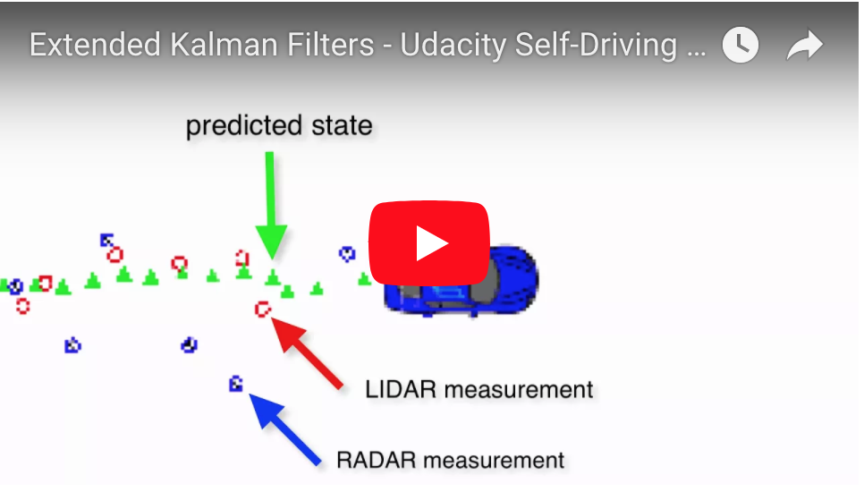
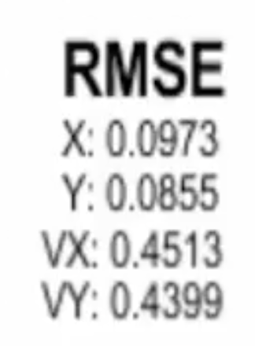

#### Udacity Self-Driving Car Engineer Nanodegree</b>
**Term 2, Project 1**
# Extended Kalman Filter

##### &nbsp;

## Summary

##### &nbsp;

### Goals
What problem are we solving?

##### &nbsp;

### Approach
Why are we using Kalman Filters? How do they work (at a high-level)?

##### &nbsp;

##### Initialize, Predict, Update
There are three main steps for programming a Kalman filter:

1. **Initialize** the Kalman filter variables.
1. **Predict** where our object is going to be after a time step Δt
1. **Update** where our object is based on sensor measurements
Then the prediction and update steps repeat themselves in a loop.

To measure how well our Kalman filter performs, we will then calculate root mean squared error comparing the Kalman filter results with the provided ground truth.

These three steps (initialize, predict, update) plus calculating RMSE encapsulate the entire extended Kalman filter project.

##### &nbsp;

### Results

</a>

##### &nbsp;

## Implementation

#### Files in the Github src Folder
The files we worked with are in the /src folder of the github repository.

- **main.cpp** &mdash; communicates with the Term 2 Simulator receiving data measurements, calls a function to run the Kalman filter, calls a function to calculate RMSE

- **FusionEKF.cpp** &mdash; initializes the filter, calls the predict function, calls the update function

- **kalman_filter.cpp** &mdash; defines the predict function, the update function for lidar, and the update function for radar

- **tools.cpp** &mdash; function to calculate RMSE and the Jacobian matrix

##### &nbsp;

#### How the Files Relate to Each Other
Here is a brief overview of what happens when you run the code files:

- `Main.cpp` reads in the data and sends a sensor measurement to `FusionEKF.cpp`
- `FusionEKF.cpp` takes the sensor data and initializes variables and updates variables. The Kalman filter equations are not in this file. `FusionEKF.cpp` has a variable called `ekf_`, which is an instance of a KalmanFilter class. The `ekf_` will hold the matrix and vector values. You will also use the `ekf_` instance to call the predict and update equations.
- The KalmanFilter class is defined in `kalman_filter.cpp` and `kalman_filter.h`

##### &nbsp;

#### Scope & Steps
1. In `tools.cpp`, fill in the functions that calculate root mean squared error (RMSE) and the Jacobian matrix.
2. Fill in the code in `FusionEKF.cpp`. You'll need to initialize the Kalman Filter, prepare the Q and F matrices for the prediction step, and call the radar and lidar update functions.
3. In `kalman_filter.cpp`, fill out the `Predict()`, `Update()`, and `UpdateEKF()` functions.
5. Initialize the State Vector
 - You'll need to initialize the state vector  with the first sensor measurement.
 - Although radar gives velocity data in the form of the range rate
​`ρ˙`, a radar measurement does not contain enough information to determine the state variable velocities `vx` and `vy`. You can, however, use the radar measurements `ρ` and `ϕ` to initialize the state variable locations `p​x` and `py`.
6. Calculate `y = z - H * x'`
 - For lidar measurements, the error equation is `y = z - H * x'`. For radar measurements, the functions that map the x vector `[px, py, vx, vy]` to polar coordinates are non-linear. Instead of using H to calculate `y = z - H * x'`, for radar measurements you'll have to use the equations that map from cartesian to polar coordinates: `y = z - h(x')`.
7. Normalize Angles
 - In C++, `atan2()` returns values between -pi and pi. When calculating phi in `y = z - h(x)` for radar measurements, the resulting angle phi in the y vector should be adjusted so that it is between -pi and pi. The Kalman filter is expecting small angle values between the range -pi and pi. When working in radians, we need to add 2π or subtract 2π until the angle is within the desired range.
8. Avoid Divide by Zero throughout the Implementation
 - Before and while calculating the Jacobian matrix `Hj`, make sure your code avoids dividing by zero. For example, both the `x` and `y` values might be zero or `px*px + py*py` might be close to zero. What should be done in those cases?
4. No Need to Tune Parameters.
  - The R matrix values and Q noise values are provided for you. There is no need to tune these parameters for this project. In the unscented Kalman Filter lectures, we'll discuss how to determine these parameters.
9. Test Your Implementation
 - Test! We're giving you the ability to analyze your output data and calculate RMSE. As you make changes, keep testing your algorithm! If you are getting stuck, add print statements to pinpoint any issues. But please remove extra print statements before turning in the code.

 ##### &nbsp;

---

# Project Starter Code

In this project you will utilize a kalman filter to estimate the state of a moving object of interest with noisy lidar and radar measurements. Passing the project requires obtaining RMSE values that are lower that the tolerance outlined in the project rubric.

This project involves the Term 2 Simulator which can be downloaded [here](https://github.com/udacity/self-driving-car-sim/releases)

This repository includes two files that can be used to set up and install [uWebSocketIO](https://github.com/uWebSockets/uWebSockets) for either Linux or Mac systems. For windows you can use either Docker, VMware, or even [Windows 10 Bash on Ubuntu](https://www.howtogeek.com/249966/how-to-install-and-use-the-linux-bash-shell-on-windows-10/) to install uWebSocketIO. Please see [this concept in the classroom](https://classroom.udacity.com/nanodegrees/nd013/parts/40f38239-66b6-46ec-ae68-03afd8a601c8/modules/0949fca6-b379-42af-a919-ee50aa304e6a/lessons/f758c44c-5e40-4e01-93b5-1a82aa4e044f/concepts/16cf4a78-4fc7-49e1-8621-3450ca938b77) for the required version and installation scripts.

Once the install for uWebSocketIO is complete, the main program can be built and run by doing the following from the project top directory.

1. mkdir build
2. cd build
3. cmake ..
4. make
5. ./ExtendedKF

Tips for setting up your environment can be found [here](https://classroom.udacity.com/nanodegrees/nd013/parts/40f38239-66b6-46ec-ae68-03afd8a601c8/modules/0949fca6-b379-42af-a919-ee50aa304e6a/lessons/f758c44c-5e40-4e01-93b5-1a82aa4e044f/concepts/23d376c7-0195-4276-bdf0-e02f1f3c665d)

Note that the programs that need to be written to accomplish the project are src/FusionEKF.cpp, src/FusionEKF.h, kalman_filter.cpp, kalman_filter.h, tools.cpp, and tools.h

The program main.cpp has already been filled out, but feel free to modify it.

Here is the main protcol that main.cpp uses for uWebSocketIO in communicating with the simulator.

INPUT: values provided by the simulator to the c++ program

["sensor_measurement"] => the measurement that the simulator observed (either lidar or radar)

OUTPUT: values provided by the c++ program to the simulator

["estimate_x"] <= kalman filter estimated position x
["estimate_y"] <= kalman filter estimated position y
["rmse_x"]
["rmse_y"]
["rmse_vx"]
["rmse_vy"]

---

## Other Important Dependencies

* cmake >= 3.5
  * All OSes: [click here for installation instructions](https://cmake.org/install/)
* make >= 4.1 (Linux, Mac), 3.81 (Windows)
  * Linux: make is installed by default on most Linux distros
  * Mac: [install Xcode command line tools to get make](https://developer.apple.com/xcode/features/)
  * Windows: [Click here for installation instructions](http://gnuwin32.sourceforge.net/packages/make.htm)
* gcc/g++ >= 5.4
  * Linux: gcc / g++ is installed by default on most Linux distros
  * Mac: same deal as make - [install Xcode command line tools](https://developer.apple.com/xcode/features/)
  * Windows: recommend using [MinGW](http://www.mingw.org/)

## Basic Build Instructions

1. Clone this repo.
2. Make a build directory: `mkdir build && cd build`
3. Compile: `cmake .. && make`
   * On windows, you may need to run: `cmake .. -G "Unix Makefiles" && make`
4. Run it: `./ExtendedKF `

## Editor Settings

We've purposefully kept editor configuration files out of this repo in order to
keep it as simple and environment agnostic as possible. However, we recommend
using the following settings:

* indent using spaces
* set tab width to 2 spaces (keeps the matrices in source code aligned)

## Code Style

Please (do your best to) stick to [Google's C++ style guide](https://google.github.io/styleguide/cppguide.html).

## Generating Additional Data

This is optional!

If you'd like to generate your own radar and lidar data, see the
[utilities repo](https://github.com/udacity/CarND-Mercedes-SF-Utilities) for
Matlab scripts that can generate additional data.

## Project Instructions and Rubric

Note: regardless of the changes you make, your project must be buildable using
cmake and make!

More information is only accessible by people who are already enrolled in Term 2
of CarND. If you are enrolled, see [the project resources page](https://classroom.udacity.com/nanodegrees/nd013/parts/40f38239-66b6-46ec-ae68-03afd8a601c8/modules/0949fca6-b379-42af-a919-ee50aa304e6a/lessons/f758c44c-5e40-4e01-93b5-1a82aa4e044f/concepts/382ebfd6-1d55-4487-84a5-b6a5a4ba1e47)
for instructions and the project rubric.
