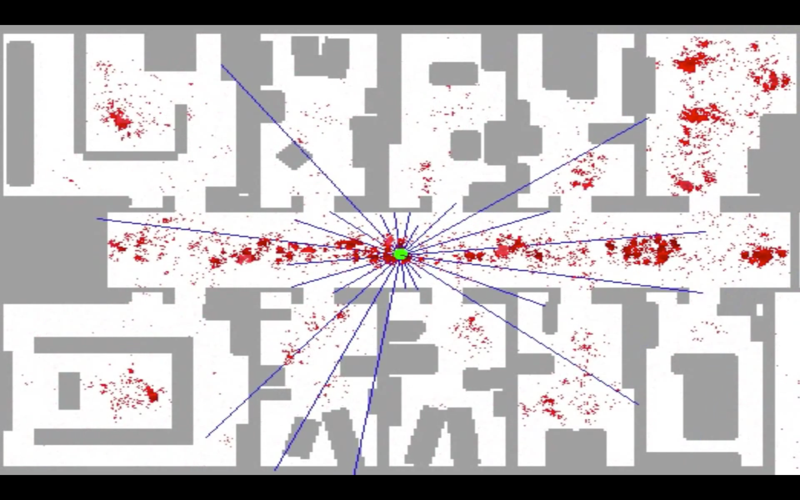
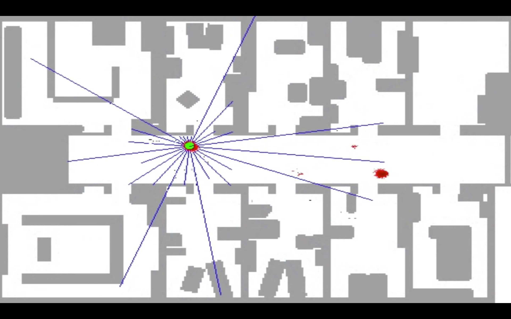
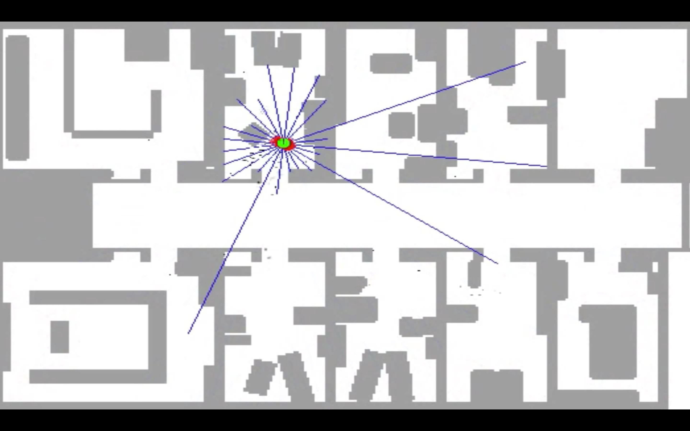
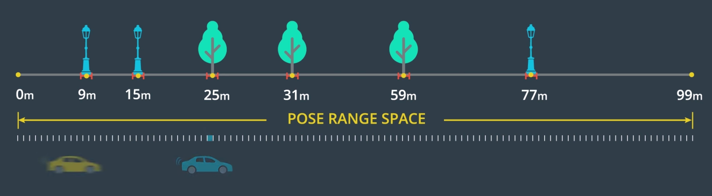
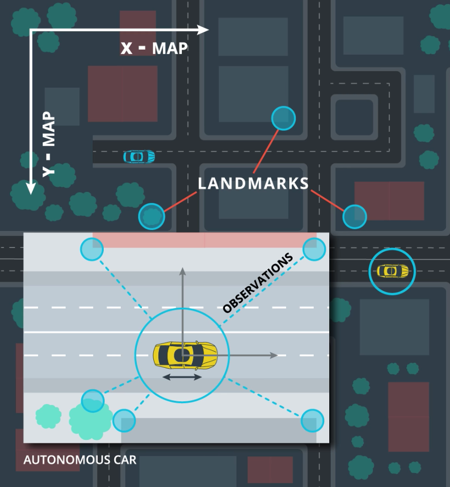
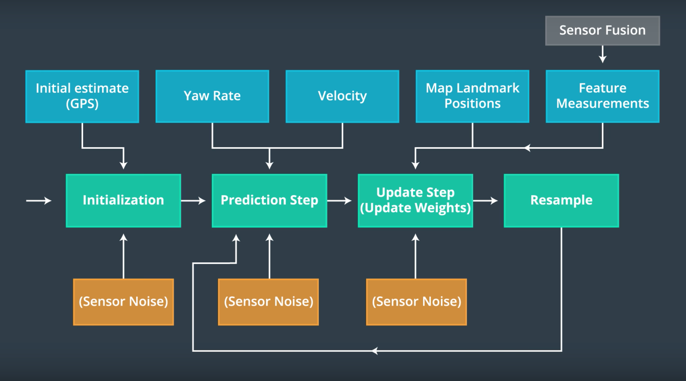
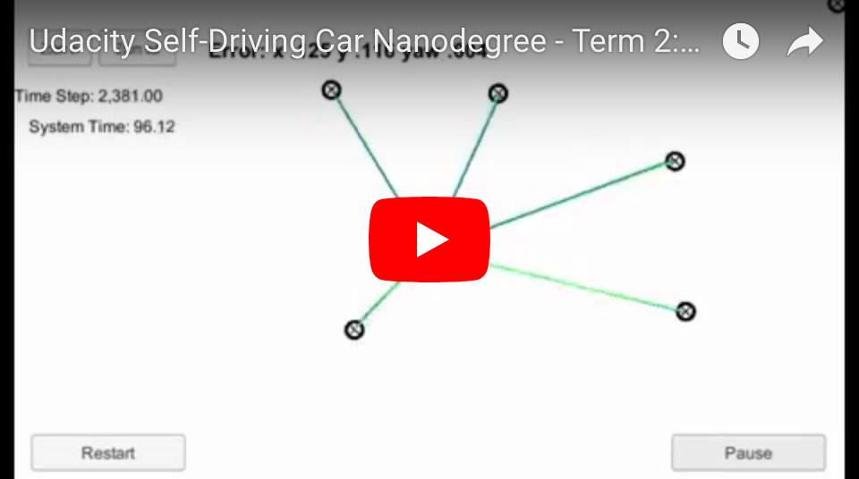
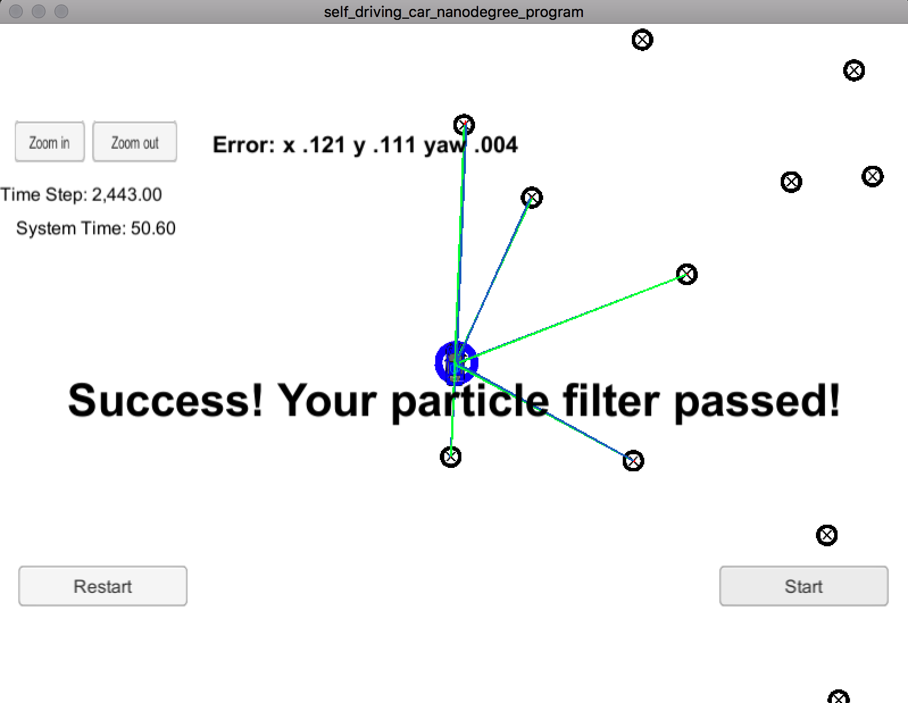

#### Udacity Self-Driving Car Engineer Nanodegree

# Term 2 / Project 3: Particle Filter for Kidnapped Vehicle

##### &nbsp;

</a>

##### &nbsp;

## Goal
The goal of this project is to provide the exact location of a vehicle on a map while it drives. The core problem is that localization via GPS is limited to 1-5 meters or more. Whereas, to safely navigate a car, we need localization accuracy on the order of 10 centimeters.

In this project, we use GPS as an initial coarse estimate of the vehicle's location, but then use the vehicle's lidar sensors, control data, and a map to derive more precise location estimates. This achieved by developing a particle filter.

In the previous two projects, we used a _Kalman filter_ to predict the vehicle's location at each time step based on lidar and radar measurements of the vehicle's location from previous time steps. However, in this project, we aren't given measurements of the vehicle's location. Instead, we build a _particle filter_ that localizes the vehicle based on the known locations of landmarks it encounters while navigating its environment.

##### &nbsp;

## Approach
At a high-level, the particle filter essentially makes a series of random guesses about the location of the vehicle and compares the distance to various landmarks for each guess (aka "particle") relative to the observed distances measured by the vehicle's lidar. Initially, the particles are very dispersed. But after a few time steps, the particles located at distances from the landmarks which most resemble the observed lidar distances start to gain more weight within the model. And, as the vehicle navigates its environment, it quickly converges on the particles that most accurately (based on probability) reflect the vehicle's location on the map.

Here is an example of this progressive convergence for a robot navigating the floor of an office building. Notice how the particles are initially much more dispersed and then begin to cluster around the most likely locations given the lidar observations relative to known landmarks on the map.

##### &nbsp;

</a> &rarr; &rarr;
</a> &rarr; &rarr;

##### &nbsp;

&rarr; </a> &rarr; &rarr;
</a>

##### &nbsp;

For a vehicle traveling in one dimension, we might envision the motion model relative to landmarks as follows:

</a>

##### &nbsp;

For a vehicle traveling in two dimensions (as in this project), we can picture the motion model relative to the landmarks like this:

</a>

##### &nbsp;

In constructing the particle filter, here is an overview of the inputs and logic steps.

</a>

## Results
Here is a video showing the output of the particle filter within the simulator.

It's a little difficult to see, but the blue circle and black arrow are the real-time estimation of the vehicle’s location and heading. 

The blue car is the ground truth of the vehicle's actual location. The goal is to make sure the circle (predicted location) is around the car as it navigates the environment.

<a href="https://youtu.be/91ONIsQJRFY"></a>

##### &nbsp;

</a>

##### &nbsp;

---
In case you want to run this project yourself, here is the project starter code.

## Project Starter Code
This repository contains all the code needed to complete the final project for the Localization course in Udacity's Self-Driving Car Nanodegree.

#### Submission
All you will submit is your completed version of `particle_filter.cpp`, which is located in the `src` directory. You should probably do a `git pull` before submitting to verify that your project passes the most up-to-date version of the grading code (there are some parameters in `src/main.cpp` which govern the requirements on accuracy and run time.)

### Project Introduction
Your robot has been kidnapped and transported to a new location! Luckily it has a map of this location, a (noisy) GPS estimate of its initial location, and lots of (noisy) sensor and control data.

In this project you will implement a 2 dimensional particle filter in C++. Your particle filter will be given a map and some initial localization information (analogous to what a GPS would provide). At each time step your filter will also get observation and control data.

### Running the Code
This project involves the Term 2 Simulator which can be downloaded [here](https://github.com/udacity/self-driving-car-sim/releases)

This repository includes two files that can be used to set up and intall uWebSocketIO for either Linux or Mac systems. For windows you can use either Docker, VMware, or even Windows 10 Bash on Ubuntu to install uWebSocketIO.

Once the install for uWebSocketIO is complete, the main program can be built and ran by doing the following from the project top directory.

1. mkdir build
2. cd build
3. cmake ..
4. make
5. ./particle_filter

Alternatively some scripts have been included to streamline this process, these can be leveraged by executing the following in the top directory of the project:

1. ./clean.sh
2. ./build.sh
3. ./run.sh

Tips for setting up your environment can be found [here](https://classroom.udacity.com/nanodegrees/nd013/parts/40f38239-66b6-46ec-ae68-03afd8a601c8/modules/0949fca6-b379-42af-a919-ee50aa304e6a/lessons/f758c44c-5e40-4e01-93b5-1a82aa4e044f/concepts/23d376c7-0195-4276-bdf0-e02f1f3c665d)

Note that the programs that need to be written to accomplish the project are src/particle_filter.cpp, and particle_filter.h

The program main.cpp has already been filled out, but feel free to modify it.

Here is the main protcol that main.cpp uses for uWebSocketIO in communicating with the simulator.

INPUT: values provided by the simulator to the c++ program

// sense noisy position data from the simulator

["sense_x"]

["sense_y"]

["sense_theta"]

// get the previous velocity and yaw rate to predict the particle's transitioned state

["previous_velocity"]

["previous_yawrate"]

// receive noisy observation data from the simulator, in a respective list of x/y values

["sense_observations_x"]

["sense_observations_y"]


OUTPUT: values provided by the c++ program to the simulator

// best particle values used for calculating the error evaluation

["best_particle_x"]

["best_particle_y"]

["best_particle_theta"]

//Optional message data used for debugging particle's sensing and associations

// for respective (x,y) sensed positions ID label

["best_particle_associations"]

// for respective (x,y) sensed positions

["best_particle_sense_x"] <= list of sensed x positions

["best_particle_sense_y"] <= list of sensed y positions


Your job is to build out the methods in `particle_filter.cpp` until the simulator output says:

```
Success! Your particle filter passed!
```

## Implementing the Particle Filter
The directory structure of this repository is as follows:

```
root
|   build.sh
|   clean.sh
|   CMakeLists.txt
|   README.md
|   run.sh
|
|___data
|   |   
|   |   map_data.txt
|   
|   
|___src
    |   helper_functions.h
    |   main.cpp
    |   map.h
    |   particle_filter.cpp
    |   particle_filter.h
```

The only file you should modify is `particle_filter.cpp` in the `src` directory. The file contains the scaffolding of a `ParticleFilter` class and some associated methods. Read through the code, the comments, and the header file `particle_filter.h` to get a sense for what this code is expected to do.

If you are interested, take a look at `src/main.cpp` as well. This file contains the code that will actually be running your particle filter and calling the associated methods.

## Inputs to the Particle Filter
You can find the inputs to the particle filter in the `data` directory.

#### The Map*
`map_data.txt` includes the position of landmarks (in meters) on an arbitrary Cartesian coordinate system. Each row has three columns
1. x position
2. y position
3. landmark id

### All other data the simulator provides, such as observations and controls.

> * Map data provided by 3D Mapping Solutions GmbH.

## Success Criteria
If your particle filter passes the current grading code in the simulator (you can make sure you have the current version at any time by doing a `git pull`), then you should pass!

The things the grading code is looking for are:


1. **Accuracy**: your particle filter should localize vehicle position and yaw to within the values specified in the parameters `max_translation_error` and `max_yaw_error` in `src/main.cpp`.

2. **Performance**: your particle filter should complete execution within the time of 100 seconds.

## How to write a README
A well written README file can enhance your project and portfolio.  Develop your abilities to create professional README files by completing [this free course](https://www.udacity.com/course/writing-readmes--ud777).
