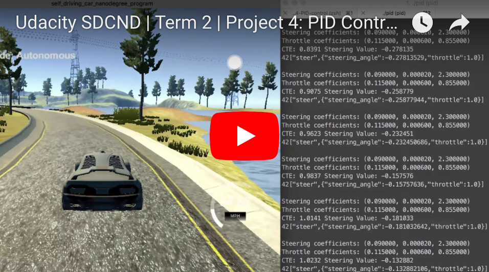

#### Udacity Self-Driving Car Engineer Nanodegree

# Term 2 / Project 4: PID Controller


##### &nbsp;

## Goal
The goal of this project is to see how fast we can get a car to safely drive around a track (via a simulator). To achieve this, we must build a Proportional, Integral, Differential (PID) controller that adjusts the vehicle's steering angle and throttle.

##### &nbsp;

## Background
PID controllers are widely used in robotics. They provide an automated way to tune the system parameters, which would otherwise need to be tuned manually. Manual tuning is a very long and tedious process and still might not yield an optimal set of parameters. So, PID controllers not only save us time, but also produce better results since an order of magnitude more permutations can be tested.

The main challenge is to tune the PID parameters so that they minimize the Cross-Track Error (CTE), and in turn, keep the vehicle driving in the middle of the road. Here is a brief explanation of the three different PID parameters:

1. Proportional coefficient (Kp). This determines the direction and magnitude of the correction. But, if it's used alone, Kp will continually overshoot the target state due to the momentum principle. When applied to the steering controller, this causes the vehicle to repeatedly swerve back and forth across the center of the road. (Note the blue line in the graph below.)

1. Integral coefficient (Ki). This alleviates any residual bias or steady-state error that occurs. For example, if the vehicle were to lose traction due to a bump in the road, a slippery surface, or by simply driving too fast through a sharp turn. (Note the yellow'ish line in the graph below, which shows how the _absence_ of the Ki parameter can cause the system to be persistently off-target.)

1. Differential coefficient (Kd). This dampens the oscillations produced by the proportional coefficient (Kp). It does this by reacting to the rate of change of the cross-track error (CTE), rather than just its magnitude or direction. While this delays the time it takes to reach the target state, Kd prevents overshooting and allows the vehicle to remain at or near the target state once it's reached. (Note in the graph below how the presence of Kd removes the oscillations.)

##### &nbsp;

Below is a graph taken from the lesson material that shows how various combinations of these parameters affect the Cross-Track Error (CTE).

</a>

##### &nbsp;


## Approach
Ultimately, I implemented two controllers: one for _steering_ and another for _throttle_. After some manual tuning initially, I relied on the Twiddle algorithm to do most of the parameter tuning for each controller. Once I derived a good set of parameters to initialize the controllers, I then used the standard CTE algorithm to update the errors during ongoing driving.

Here are the specific steps I took:

1.  **Steering Controller**. I focused on developing the steering controller first, starting with a heuristic PID parameter set of {0.1, 0.001, 1.0}.
1. **Manual tuning**. Initially, I tuned the parameters by hand. I did this for two reasons: (a) I was curious to see how the car would react and wanted to develop some intuition on how different parameter values affected driving performance, and (b) it seemed that getting a working set of parameters would provide the Twiddle algorithm a boost in the next phase of optimization. But, manual tuning quickly became tedious, and I switched to Twiddle as soon as possible.
1. **Proportional coefficient**. I started by manually tuning Kp, since it has the most direct impact on the vehicle's steering input. At first, the car kept swerving off the track. If Kp was too high, the car would turn too sharply (oversteering); if Kp was too low, the car would turn too softly (under steering). To help find the middle ground, I reduced the car's speed. Once the car could complete a full lap, I iterated a few more times at higher speeds, then moved onto the next parameter.
1. **Differential coefficient**. Next, I manually tuned Kd in order to reduce the car's repeated swerving from one side of the road to the other. Again, I would test initial parameters at lower speeds then gradually increase the speed until the car could drive safely at 20-30mph. Initially, my Kd was too low and could not counteract the swerving produced by the Kp parameter. But, when Kd was too high the steering became very twitchy, making too many tiny adjustments to the steering angle and causing the car to drive erratically, especially at higher speeds.
1. **Twiddle**. By this point, I was tired of manual tuning and figured the Integral coefficient (Ki) would be very low since the simulator (presumably) should have very little bias or steady-state error. So, I skipped manual tuning of Ki and implemented the Twiddle algorithm to handle all of the tuning moving forward. I used Sebastian's Python version of the Twiddle algorithm from the lessons as a template. But, progressing through the steps of the algorithm in C++ was a challenge. I failed to get it working using `for` and `while` loops, and ultimately treated the different steps as states using `switch` and `case` (code found [here](https://github.com/tommytracey/Udacity-CarND-Term2/blob/master/p4-PID-control/src/PID.cpp#L60)). Once the algorithm was working, I would repeatedly execute the program in 'twiddle' mode to find the best steering parameters at increasingly higher speeds. Eventually, I could fine-tune the parameters by just letting the car drive around the track in twiddle mode for dozens of laps at a time. The car seemed to top-out at 50 MPH with just the steering controller, so I then began working on the throttle controller.
1. **Throttle Controller**. I repeated the same basic steps as I did for the steering controller: starting with a heuristic parameter set, doing some manual tuning at lower speeds, and then gradually increasing the speed and leveraging the Twiddle algorithm to do most of the tuning.
I tested a few different approaches to the controller logic. After numerous blunders, such as trying to use Twiddle to optimize a `speed_error` instead of focusing on CTE for both controllers, I finally got the throttle controller working. It's basic function is to dynamically adjust the throttle based on the difference between the car's current speed and it's target speed, which is partially determined based on the car's current steering angle. The underlying premise is to produce less throttle for turns and more throttle in straightaways. But, using this construct alone, the car was unable to drive safely through sharp turns at higher speeds (> 50 MPH).
1. **Steering Gain**. To address this problem, it became clear that another coefficient or gain factor was needed to amplify the throttle response. So, a `steering_gain` coefficient was added to calculate the additional speed (`add_speed`) the car should target on top of its baseline speed (`min_speed`). (Code found [here](https://github.com/tommytracey/Udacity-CarND-Term2/blob/master/p4-PID-control/src/main.cpp#L72)). Since there are only a few sharp turns on this particular track, and by this point the other parameters were well-tuned, I figured I could just tune the new steering gain parameter by hand. But, if the track had lots of sharp turns of varying magnitudes, you'd probably be better off using Twiddle.

##### &nbsp;

## Results
Ultimately, I was able to get the car to safely navigate the track at least three times with a top speed of 88 MPH.

[Here](https://youtu.be/vfcgnVPeyVs) is a video showing the results.

<a href="https://youtu.be/vfcgnVPeyVs"></a>

##### &nbsp;

The final parameters can be found [here](https://github.com/tommytracey/Udacity-CarND-Term2/blob/master/p4-PID-control/src/main.cpp#L38):

```
// Gain factor for determining target speed relative to steering angle
double steering_gain = 3.75;

// Initialize the steering PID controller
steering_pid.Init(0.09, 0.00002, 2.3);

// Initialize the throttle PID controller
throttle_pid.Init(0.115, 0.0006, 0.855);
```

##### &nbsp;

---
In case you want to run this project yourself, below is the project starter code.

# Project Starter Code
This repository contains all the code needed to complete the final project for the Localization course in Udacity's Self-Driving Car Nanodegree.

## Dependencies

* cmake >= 3.5
 * All OSes: [click here for installation instructions](https://cmake.org/install/)
* make >= 4.1(mac, linux), 3.81(Windows)
  * Linux: make is installed by default on most Linux distros
  * Mac: [install Xcode command line tools to get make](https://developer.apple.com/xcode/features/)
  * Windows: [Click here for installation instructions](http://gnuwin32.sourceforge.net/packages/make.htm)
* gcc/g++ >= 5.4
  * Linux: gcc / g++ is installed by default on most Linux distros
  * Mac: same deal as make - [install Xcode command line tools]((https://developer.apple.com/xcode/features/)
  * Windows: recommend using [MinGW](http://www.mingw.org/)
* [uWebSockets](https://github.com/uWebSockets/uWebSockets)
  * Run either `./install-mac.sh` or `./install-ubuntu.sh`.
  * If you install from source, checkout to commit `e94b6e1`, i.e.
    ```
    git clone https://github.com/uWebSockets/uWebSockets
    cd uWebSockets
    git checkout e94b6e1
    ```
    Some function signatures have changed in v0.14.x. See [this PR](https://github.com/udacity/CarND-MPC-Project/pull/3) for more details.
* Simulator. You can download these from the [project intro page](https://github.com/udacity/self-driving-car-sim/releases) in the classroom.

There's an experimental patch for windows in this [PR](https://github.com/udacity/CarND-PID-Control-Project/pull/3)

## Basic Build Instructions

1. Clone this repo.
2. Make a build directory: `mkdir build && cd build`
3. Compile: `cmake .. && make`
4. Run it: `./pid`.

Tips for setting up your environment can be found [here](https://classroom.udacity.com/nanodegrees/nd013/parts/40f38239-66b6-46ec-ae68-03afd8a601c8/modules/0949fca6-b379-42af-a919-ee50aa304e6a/lessons/f758c44c-5e40-4e01-93b5-1a82aa4e044f/concepts/23d376c7-0195-4276-bdf0-e02f1f3c665d)

## Editor Settings

We've purposefully kept editor configuration files out of this repo in order to
keep it as simple and environment agnostic as possible. However, we recommend
using the following settings:

* indent using spaces
* set tab width to 2 spaces (keeps the matrices in source code aligned)

## Code Style

Please (do your best to) stick to [Google's C++ style guide](https://google.github.io/styleguide/cppguide.html).

## Project Instructions and Rubric

Note: regardless of the changes you make, your project must be buildable using
cmake and make!

More information is only accessible by people who are already enrolled in Term 2
of CarND. If you are enrolled, see [the project page](https://classroom.udacity.com/nanodegrees/nd013/parts/40f38239-66b6-46ec-ae68-03afd8a601c8/modules/f1820894-8322-4bb3-81aa-b26b3c6dcbaf/lessons/e8235395-22dd-4b87-88e0-d108c5e5bbf4/concepts/6a4d8d42-6a04-4aa6-b284-1697c0fd6562)
for instructions and the project rubric.

## Hints!

* You don't have to follow this directory structure, but if you do, your work
  will span all of the .cpp files here. Keep an eye out for TODOs.

## Call for IDE Profiles Pull Requests

Help your fellow students!

We decided to create Makefiles with cmake to keep this project as platform
agnostic as possible. Similarly, we omitted IDE profiles in order to we ensure
that students don't feel pressured to use one IDE or another.

However! I'd love to help people get up and running with their IDEs of choice.
If you've created a profile for an IDE that you think other students would
appreciate, we'd love to have you add the requisite profile files and
instructions to ide_profiles/. For example if you wanted to add a VS Code
profile, you'd add:

* /ide_profiles/vscode/.vscode
* /ide_profiles/vscode/README.md

The README should explain what the profile does, how to take advantage of it,
and how to install it.

Frankly, I've never been involved in a project with multiple IDE profiles
before. I believe the best way to handle this would be to keep them out of the
repo root to avoid clutter. My expectation is that most profiles will include
instructions to copy files to a new location to get picked up by the IDE, but
that's just a guess.

One last note here: regardless of the IDE used, every submitted project must
still be compilable with cmake and make./

## How to write a README
A well written README file can enhance your project and portfolio.  Develop your abilities to create professional README files by completing [this free course](https://www.udacity.com/course/writing-readmes--ud777).
