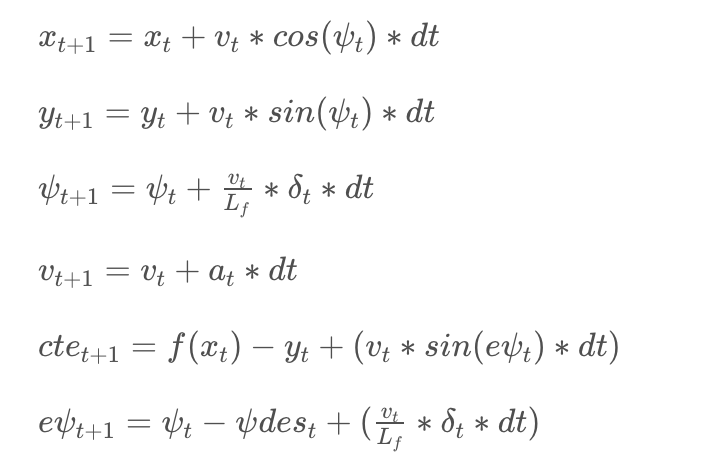

#### Udacity Self-Driving Car Engineer Nanodegree

# Term 2 / Project 5: PID Controller


##### &nbsp;

## Goal
The goal of this project is to autonomously drive a car around the track in a simulator using a Predictive Control Model. The vehicle must safely navigate the course without leaving the track and there's a secondary goal to maximize its driving speed measured in miles per hour (MPH). To achieve these goals, students must build a Model Predictive Controller (MPC) that adjusts the vehicle's steering angle and throttle.

##### &nbsp;

## Background
This is the third project in which we've developed a model to navigate the simulator track, each of them utilizing different types of models and data inputs. The first project was [Behavioral Cloning](https://github.com/tommytracey/udacity/tree/master/self-driving-nano/projects/3-behavioral-cloning), in which we developed a deep learning model based on inputs from three cameras mounted on the front of the car. For the second project, we built a [PID Controller](https://github.com/tommytracey/Udacity-CarND-Term2/tree/master/p4-PID-control) based on the cross-track error (CTE), i.e. the distance from the center of the track. For this third project, we need to build a Model Predictive Controller (MPC) given the vehicle's telemetry data (position, velocity, heading) and a series of waypoints for the stretch of track immediately ahead.

The advantage of a MPC is that it uses third order polynomials to determine the best path for the vehicle. Then, it uses a kinematic model and cost function to find the best actions (steering, throttle) to achieve this path, while accounting for the vehicle's constraints (e.g. its maximum steering angle). This type of model requires more computation the PID controller we developed previously, but it results in much smoother steering and throttle controls. However, one of the challenges is to ensure your model is efficient enough to control the vehicle in real-time, plus the 0.1 second delay that's added to the simulation to mimic real-world system latency.

##### &nbsp;

## Approach

### Waypoints
The first task is to calculate an optimal trajectory. We start by transforming the waypoints from track coordinates into the vehicle space. This will simplify the calculations in a later step, when we use the IPOPT and CPPAD packages to calculate the optimal trajectory and associated actuation commands (i.e. those which minimize error).

[Here](https://github.com/tommytracey/Udacity-CarND-Term2/blob/master/p5-model-predictive-control/src/main.cpp#L101) is the part of my code where the waypoints are converted.

### Kinematic Model & Latency
To plan the car's movement along a defined trajectory, we use a global kinematic model. This is a simplification of a dynamic model that ignores physical forces such as gravity, tire friction, and vehicle mass.

The kinematic model consists of a vehicle state and actuators. The vehicle state is represented as a vector `(px, py, psi, v, cte, epsi)`, where `px` is the car's x coordinate, `py` is the car’s y coordinate, `psi` is the car’s orientation or heading direction, `v` is the car's velocity, `cte` is the cross track error, and `epsi` is the error in the car's orientation compared to the reference trajectory.

Here are the kinematic equations used to update the vehicle state:

</a>

[Here](https://github.com/tommytracey/Udacity-CarND-Term2/blob/master/p5-model-predictive-control/src/main.cpp#L120) is the part of my code where the kinematic model is implemented, accounting for system latency. To do this, the actual state of the vehicle was shifted into the future by the expected duration of the latency (0.1 seconds). This is done in `main.cpp` before passing the state variables to the MPC. Intuitively, this seemed better than handling the latency downstream, but I did not test any other approaches.

```c++
// Kinematic model that predicts vehicle state accounting for latency
const double lat = 0.1; // latency
const double px_lat = v * lat;
const double py_lat = 0;
const double psi_lat = -v * steering_angle * lat / LF;
const double v_lat = v + throttle * lat;
const double cte_lat = cte + v * sin(epsi) * lat;
const double epsi_lat = epsi + psi_lat;
```

### Actuators
The actuators are the set of controls used to navigate the vehicle. Only two actuators are used in this project: `delta` and acceleration (represented by the variable `a`). "Acceleration" is a bit of misnomer as it refers to both acceleration and deceleration. The acceleration value&mdash;also referred to as "throttle"&mdash; is between -1 and 1 (negative values are for braking). Meanwhile, `delta` represents the steering angle, accounting for constraints to vehicle's steering radius.

Once the model and parameters are setup, we then cycle through these steps:

1. Current state is passed to the model predictive controller (as the new initial state)
1. The optimization solver is called.
1. The solver returns the vector of actuators that minimizes the cost function.
1. The steering and throttle commands are applied to the vehicle.
1. Repeat


### Timesteps
I ultimately settled on values of `N = 17` (timestep length) and `dt = 0.1` (elapsed duration between timesteps). I experimented with higher values for `N`, but it required more computation and predicting that far into the future was not necessary at speeds of 70-80 MPH. If the car was traveling at 100 MPH, then perhaps 20 timesteps would be appropriate. But any more than that is probably a waste of computation and could hinder the model's ability to produce actuator commands quickly enough. Conversely, with lower values for N, the model would not take into account enough of the upcoming track when traveling at high speeds. This resulted in a set of actuator commands that didn't properly plan for sharp turns, and therefore the car would veer off the track. So, as I increased the target speed, I also increased the number of timesteps in the model. My first working version had `N = 10` and I worked my way up from there.

I also experimented with different values for `dt`. With smaller values, the model produces actuator commands too quickly, so the car drives erratically, i.e. it's constantly turning back and forth and making too many throttle changes. I determined that generating actuators at this frequency is superfluous unless the vehicle is traveling at very high speeds (100+ MPH). Conversely, with larger values for `dt`, too much time elapsed between actuations. So, although the car would drive smoothly, it would react too slowly to turns when traveling at higher speeds and inevitably veer off the track.  

### Weights
The other critical parameters are the weights applied to the variables within the kinematic model. For example, in developing my model, I found that placing a lot of weight on the steering delta produced the best results. So, the value for `w_delta` is very high. I also found that putting more weight on the cross-track error was effective, therefore the value for `w_cte` is relatively high.

[Here](https://github.com/tommytracey/Udacity-CarND-Term2/blob/master/p5-model-predictive-control/src/MPC.cpp#L51) is how the weight parameters are applied within the code:

```c++
// The cost is stored is the first element of `fg`.
// Any additions to the cost should be added to `fg[0]`.
fg[0] = 0;

// The part of the cost based on the reference state.
for (int i = 0; i < N; i++) {
  fg[0] += w_cte * CppAD::pow(vars[cte_start + i] - r_cte, 2);
  fg[0] += w_epsi * CppAD::pow(vars[epsi_start + i] - r_epsi, 2);
  fg[0] += w_v * CppAD::pow(vars[v_start + i] - r_v, 2);
}

// Minimize the use of actuators.
for (int i = 0; i < N - 1; i++) {
  fg[0] += w_delta * CppAD::pow(vars[delta_start + i], 2);
  fg[0] += w_a * CppAD::pow(vars[a_start + i], 2);
}

// Minimize the value gap between sequential actuations.
for (int i = 0; i < N - 2; i++) {
  fg[0] += w_ddelta * CppAD::pow(vars[delta_start + i + 1] - vars[delta_start + i], 2);
  fg[0] += w_da * CppAD::pow(vars[a_start + i + 1] - vars[a_start + i], 2);
}
```

[Here](https://github.com/tommytracey/Udacity-CarND-Term2/blob/master/p5-model-predictive-control/src/MPC.cpp#L8) is the final set of parameters that I arrived at mostly via trial-and-error, plus a few hints from threads in the project Slack channel. Once I was able to get the car to navigate the track at 30 MPH, I then steadily increased the speed and fine tuned the parameters.

##### &nbsp;

## Results
Ultimately, I was able to get the car to safely navigate the track at least 2 times with a top speed of 74 MPH.

[Here](https://youtu.be/ATElmSKxF2g) is a video showing the results.

<a href="https://youtu.be/ATElmSKxF2g"></a>

##### &nbsp;

---
In case you want to run this project yourself, below is the project starter code.

# Project Starter Code
This repository contains all the code needed to complete the final project for the Localization course in Udacity's Self-Driving Car Nanodegree.

## Dependencies

* cmake >= 3.5
 * All OSes: [click here for installation instructions](https://cmake.org/install/)
* make >= 4.1(mac, linux), 3.81(Windows)
  * Linux: make is installed by default on most Linux distros
  * Mac: [install Xcode command line tools to get make](https://developer.apple.com/xcode/features/)
  * Windows: [Click here for installation instructions](http://gnuwin32.sourceforge.net/packages/make.htm)
* gcc/g++ >= 5.4
  * Linux: gcc / g++ is installed by default on most Linux distros
  * Mac: same deal as make - [install Xcode command line tools]((https://developer.apple.com/xcode/features/)
  * Windows: recommend using [MinGW](http://www.mingw.org/)
* [uWebSockets](https://github.com/uWebSockets/uWebSockets)
  * Run either `install-mac.sh` or `install-ubuntu.sh`.
  * If you install from source, checkout to commit `e94b6e1`, i.e.
    ```
    git clone https://github.com/uWebSockets/uWebSockets
    cd uWebSockets
    git checkout e94b6e1
    ```
    Some function signatures have changed in v0.14.x. See [this PR](https://github.com/udacity/CarND-MPC-Project/pull/3) for more details.

* **Ipopt and CppAD:** Please refer to [this document](https://github.com/udacity/CarND-MPC-Project/blob/master/install_Ipopt_CppAD.md) for installation instructions.
* [Eigen](http://eigen.tuxfamily.org/index.php?title=Main_Page). This is already part of the repo so you shouldn't have to worry about it.
* Simulator. You can download these from the [releases tab](https://github.com/udacity/self-driving-car-sim/releases).
* Not a dependency but read the [DATA.md](./DATA.md) for a description of the data sent back from the simulator.


## Basic Build Instructions

1. Clone this repo.
2. Make a build directory: `mkdir build && cd build`
3. Compile: `cmake .. && make`
4. Run it: `./mpc`.

## Tips

1. It's recommended to test the MPC on basic examples to see if your implementation behaves as desired. One possible example
is the vehicle starting offset of a straight line (reference). If the MPC implementation is correct, after some number of timesteps
(not too many) it should find and track the reference line.
2. The `lake_track_waypoints.csv` file has the waypoints of the lake track. You could use this to fit polynomials and points and see of how well your model tracks curve. NOTE: This file might be not completely in sync with the simulator so your solution should NOT depend on it.
3. For visualization this C++ [matplotlib wrapper](https://github.com/lava/matplotlib-cpp) could be helpful.)
4.  Tips for setting up your environment are available [here](https://classroom.udacity.com/nanodegrees/nd013/parts/40f38239-66b6-46ec-ae68-03afd8a601c8/modules/0949fca6-b379-42af-a919-ee50aa304e6a/lessons/f758c44c-5e40-4e01-93b5-1a82aa4e044f/concepts/23d376c7-0195-4276-bdf0-e02f1f3c665d)
5. **VM Latency:** Some students have reported differences in behavior using VM's ostensibly a result of latency.  Please let us know if issues arise as a result of a VM environment.

## Editor Settings

We've purposefully kept editor configuration files out of this repo in order to
keep it as simple and environment agnostic as possible. However, we recommend
using the following settings:

* indent using spaces
* set tab width to 2 spaces (keeps the matrices in source code aligned)

## Code Style

Please (do your best to) stick to [Google's C++ style guide](https://google.github.io/styleguide/cppguide.html).

## Project Instructions and Rubric

Note: regardless of the changes you make, your project must be buildable using
cmake and make!

More information is only accessible by people who are already enrolled in Term 2
of CarND. If you are enrolled, see [the project page](https://classroom.udacity.com/nanodegrees/nd013/parts/40f38239-66b6-46ec-ae68-03afd8a601c8/modules/f1820894-8322-4bb3-81aa-b26b3c6dcbaf/lessons/b1ff3be0-c904-438e-aad3-2b5379f0e0c3/concepts/1a2255a0-e23c-44cf-8d41-39b8a3c8264a)
for instructions and the project rubric.

## Hints!

* You don't have to follow this directory structure, but if you do, your work
  will span all of the .cpp files here. Keep an eye out for TODOs.

## Call for IDE Profiles Pull Requests

Help your fellow students!

We decided to create Makefiles with cmake to keep this project as platform
agnostic as possible. Similarly, we omitted IDE profiles in order to we ensure
that students don't feel pressured to use one IDE or another.

However! I'd love to help people get up and running with their IDEs of choice.
If you've created a profile for an IDE that you think other students would
appreciate, we'd love to have you add the requisite profile files and
instructions to ide_profiles/. For example if you wanted to add a VS Code
profile, you'd add:

* /ide_profiles/vscode/.vscode
* /ide_profiles/vscode/README.md

The README should explain what the profile does, how to take advantage of it,
and how to install it.

Frankly, I've never been involved in a project with multiple IDE profiles
before. I believe the best way to handle this would be to keep them out of the
repo root to avoid clutter. My expectation is that most profiles will include
instructions to copy files to a new location to get picked up by the IDE, but
that's just a guess.

One last note here: regardless of the IDE used, every submitted project must
still be compilable with cmake and make./

## How to write a README
A well written README file can enhance your project and portfolio.  Develop your abilities to create professional README files by completing [this free course](https://www.udacity.com/course/writing-readmes--ud777).
